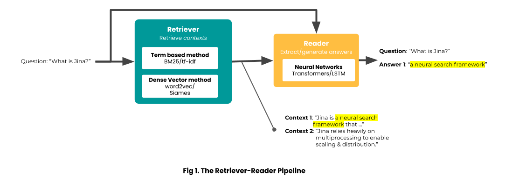

# Build An Open Domain Question-Answering (ODQA) System with Jina

Check out the full story at [our blog site](https://jina.ai/blog/2021-11-29-odqa-part-1/).

## Usage

In an ODQA system, the two-stage pipeline consisting of `retriever` and `reader` is a common choice. In this example, we
offer two implementations including

- Dense Passage Retrieval
- RocketQA



As for the `retriever` part, instead of the term-based methods, both implementations use the dense-vector-based methods.
In both cases, we use the `reader` implementation from DPR.

### RocketQA

```shell
cd rocketqa
python -m venv rocketqa-env
source dpr-env/bin/activate
pip install -r requirements.txt
python index.py
python query.py
```

<!--gif-->

### Dense Passage Retrieval

```shell
cd dpr
python -m venv dpr-env
source dpr-env/bin/activate
pip install -r requirements.txt
python index.py
python query.py
```

<!--gif-->

